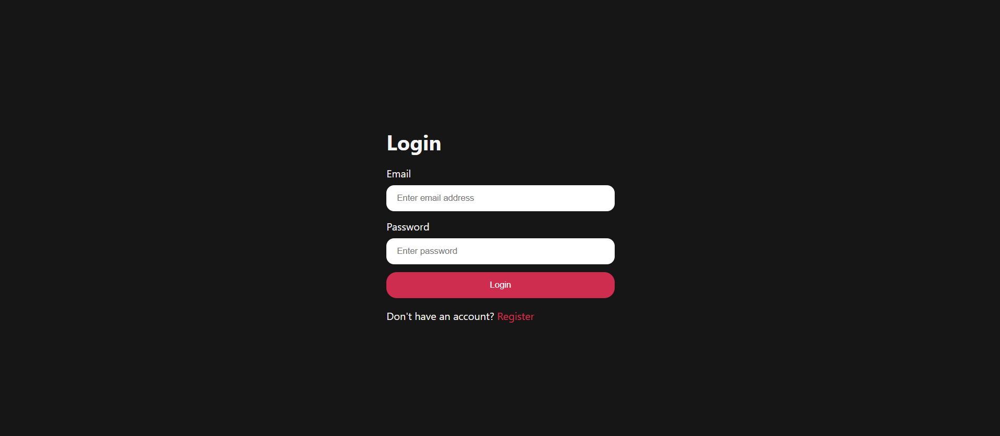
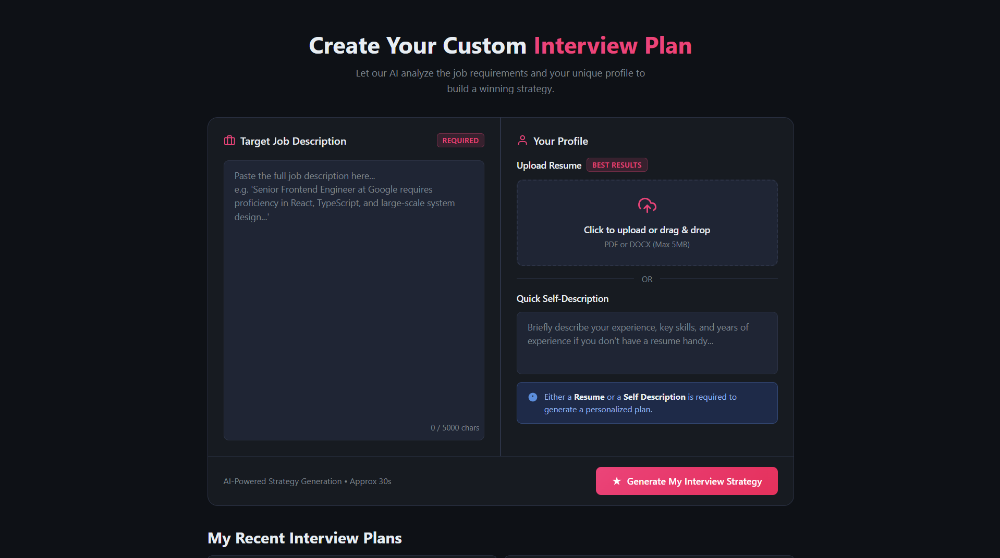
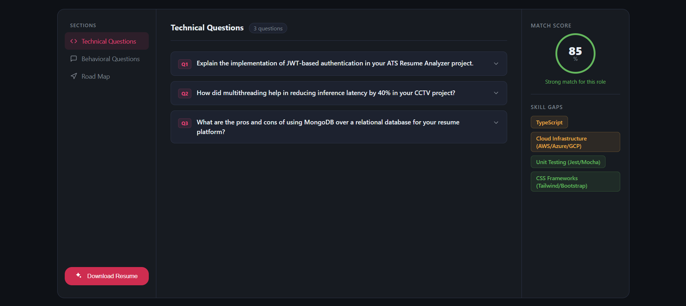
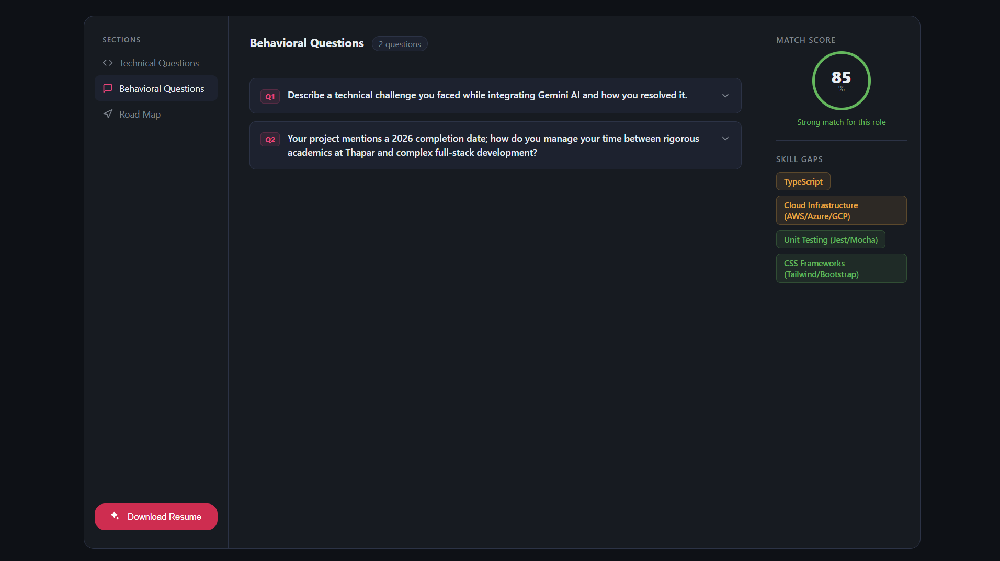
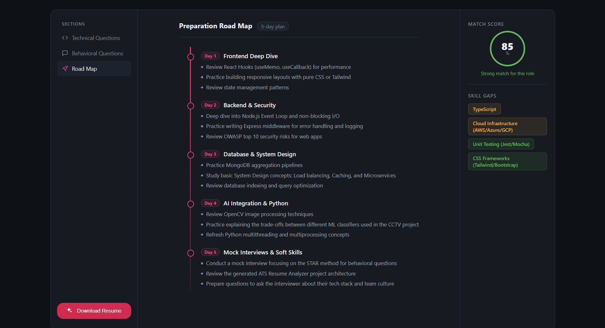
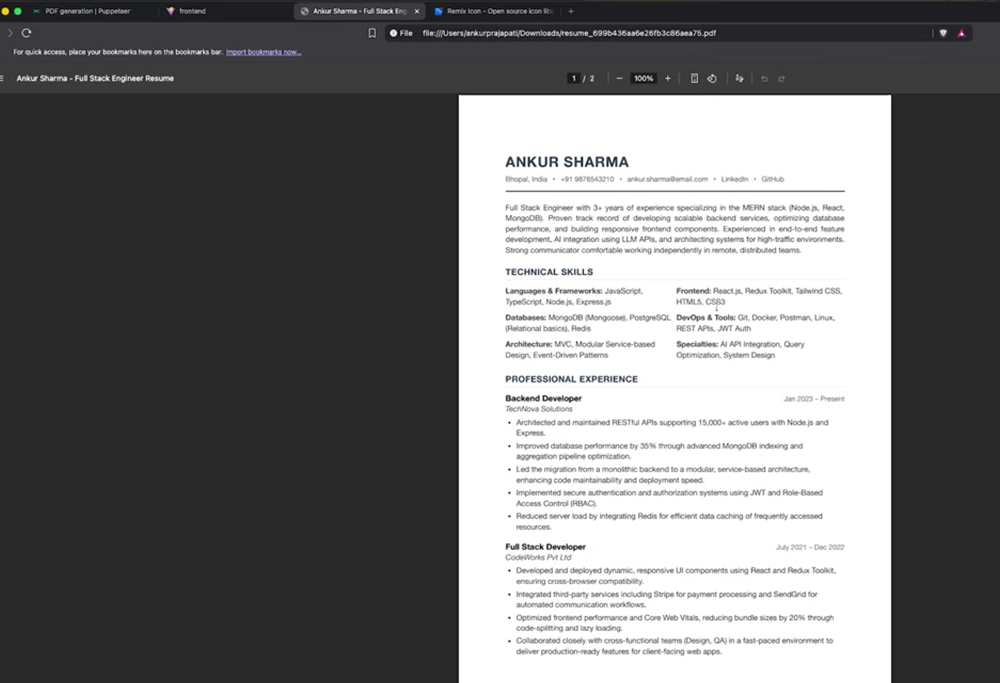

# GenAI-Powered ATS Resume Analyzer & Interview Preparation Platform


An AI-powered full-stack web application that analyzes resumes against job descriptions, generates personalized interview preparation plans, identifies skill gaps, and creates ATS-optimized resumes using Google's Gemini AI.

## Features

- Secure user authentication with JWT
- Upload resume (PDF/DOCX)
- AI-powered resume analysis
- Job description matching
- Personalized interview preparation strategy
- Technical interview questions
- Behavioral interview questions
- Personalized preparation roadmap
- Resume match score and skill gap analysis
- AI-generated ATS-friendly resume
- Download generated resume as PDF
- View previous interview reports

## Tech Stack

### Frontend
- React
- Vite
- React Router
- Axios
- Sass

### Backend
- Node.js
- Express.js
- MongoDB
- Mongoose
- JWT Authentication
- Multer
- Google Gemini AI
- Puppeteer
- Zod

---


## Application Preview

### Authentication



### Dashboard



### Interview Preparation





### Personalized Roadmap



### ATS Resume Generation



---

## Architecture

```text
React (Frontend)
        │
        ▼
Express.js REST API
        │
        ├────────► Google Gemini AI
        │
        ▼
MongoDB Atlas
```

## Project Structure

```
genai-ats-resume-analyzer/
│
├── Backend/
│   ├── src/
│   ├── server.js
│   └── package.json
│
├── Frontend/
│   ├── src/
│   ├── public/
│   └── package.json
│
└── assets/
    └── screenshots/
```

---

## Installation

### Clone the repository

```bash
git clone https://github.com/lakshitmehta/genai-ats-resume-analyzer.git
```

### Backend

```bash
cd Backend
npm install
npm run dev
```

### Frontend

```bash
cd Frontend
npm install
npm run dev
```

---

## Environment Variables

Create a `.env` file inside the `Backend` directory.

Example:

```env
PORT=5000
MONGODB_URI=your_mongodb_connection_string
JWT_SECRET=your_jwt_secret
GOOGLE_API_KEY=your_gemini_api_key
```

> **Note:** Never commit your `.env` file or API keys to GitHub.

---

## Future Improvements

- Resume keyword optimization
- Multi-language resume generation
- Interview analytics dashboard
- AI mock interview with voice interaction
- Email interview reports
- Docker support

---

## Acknowledgements

## Acknowledgements

This project was built while following a public tutorial by **Ankur** as a learning resource. The codebase has been independently configured, documented, organized, and maintained for educational and portfolio purposes.

## License

This project is licensed under the MIT License.